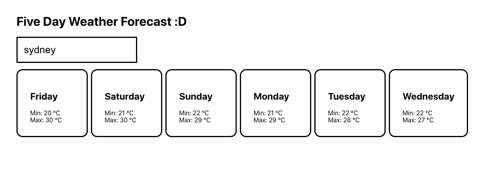

## NAB Coding Challenge

Hello!

My name is Julius. Thank you for looking into my code! I basically spent a few hours hacking it together, I hope you think it's awesome. :grin:

## Structure

Here are the main folders:
  - `src` - UI application source code
  - `tests` - UI application test code
  - `server` - server application source code

## Setup

In the root directory run:
  - `npm install` - this will install all the Node.js libraries
  - Please install Node.js onto your machine if you have not already i.e. `https://nodejs.org/en/download/`

## Running

To run the application, please enter into two separate terminals:
  - `npm run start:client` - this will start the client
  - `npm run start:server` - this will start the server
  - Once they are both up and running, please head to `http://localhost:3000/`

To run the tests, please enter:
  - `npm test`
  - You may need to install watchman onto your machine. I know I had issues with it for whatever reason i.e. `brew install watchman` (assuming you have brew installed)

## Future Improvements

- Create seperate `package.json` and `src` folders for client and server code
- Implement some kind of GraphQL server for retrieving the weather data
- Write server tests, as well as integration tests
- Extend the UI tests, they're pretty barebones
- Implement test coverage, along with linting and git hooks
- Mobile responsiveness
- Make it look waaayyyyyy nicer
- I know some of the async behaviour is a little flakey, but I didn't have time to look into it
  - An easy fix is to simply implement a button to fetch the data which disables when you click on it, instead of it fetching in real-time since `useEffect` isn't async, but I thought it being in real-time would be cooler.
  - Implementing something like GraphQL or redux with async state management would have probably solved it as well.
